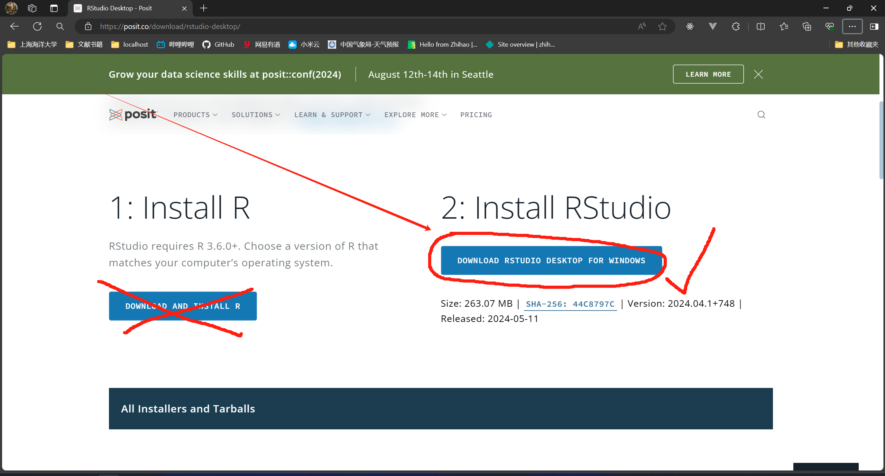
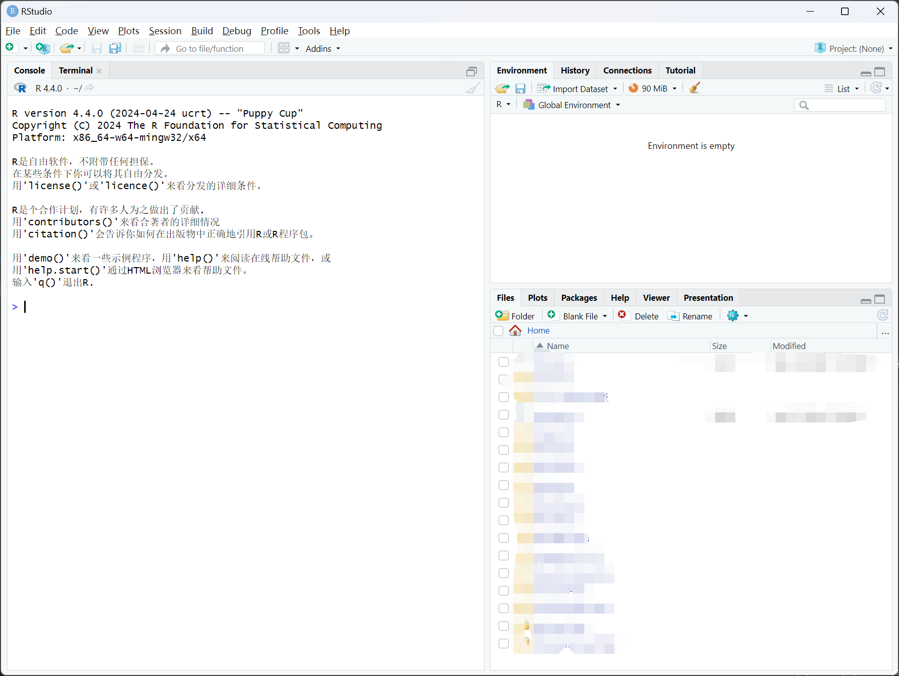

RStudio 可以是一款 R 语言的集成开发环境（IDE），可以让我们写 R 语言时更加方便。

:::tip
除了 RStudio，你还可以选择 VSCode、或者 Pycharm 作为 R 语言的开发工具。
:::

## RStudio 的下载安装

[RStudio 官网下载链接](https://posit.co/download/rstudio-desktop/)

进入后可以找到 `2. Install RStudio` 字样，并下载。

下载后可以一直下一步，什么设置都不需要改（你也可以根据需要修改文件路径，因为有 1.1 个 G 的大文件），直到安装完成。

## 打开 RStudio

打开后如果是这样的界面，及说明安装成功。

简单介绍：
- 左侧
  - Console: 位于页面左侧的窗口，为控制台，交互式使用 R 语言，和在 cmd 和 powershell 中打开的 R.exe 一样。
  - Terminal: 在 Console 旁边因为我的电脑上装了 MINGW64，所以有个 Terminal，其他的电脑可能没有，这个不重要。
- 右上角
  - Environment: 当前 R 语言的环境，比如赋值 x 为 1，则右侧的 Environment 下会出现 Values: x 1。
  - History: 使用过的代码，历史记录。
  - Connections: 暂时不知道。
  - Tutorial: RStudio 的教程。
- 右下角
  - Files: 类似于文件资源管理器、文件夹。
  - Plots: 做图，当使用 `plot` 函数时会出现一张图。
  - Packages: 导入的拓展包，这些包可以协助数据分析和计算。
  - Help: 文档、指南。
  - Viewer: 暂时不知道。
  - Presentation: 暂时不知道。

## 简单使用

1. 当打开 `.r` 文件时，右上角的 `run` 是运行本行代码；想要运行所有代码，使用 `ctrl` + `shift` + `enter`。
