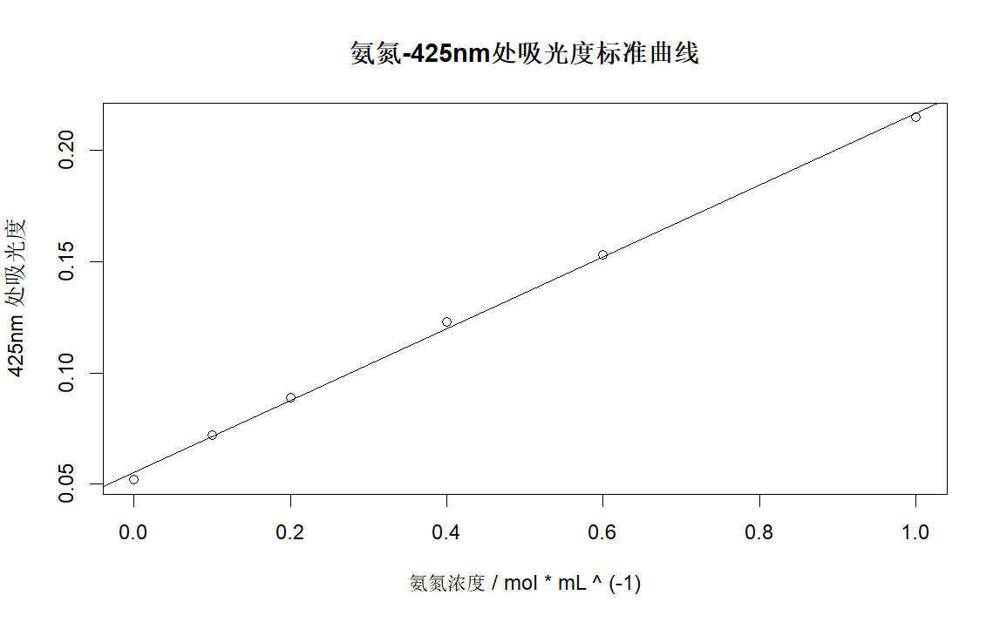
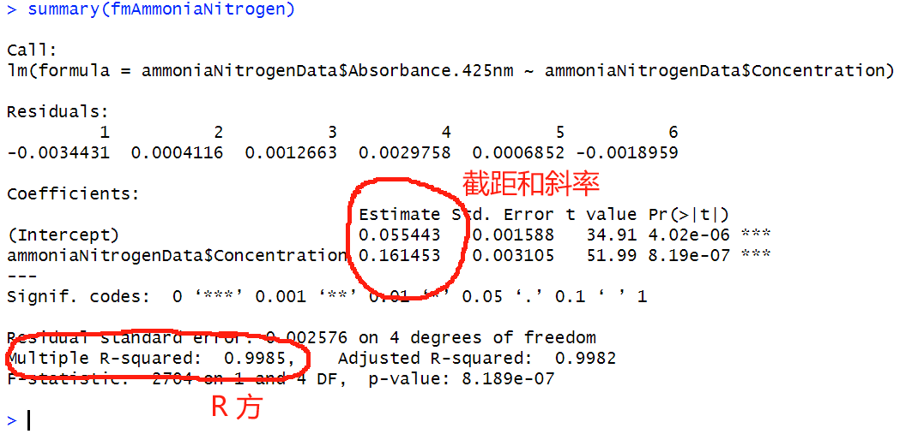
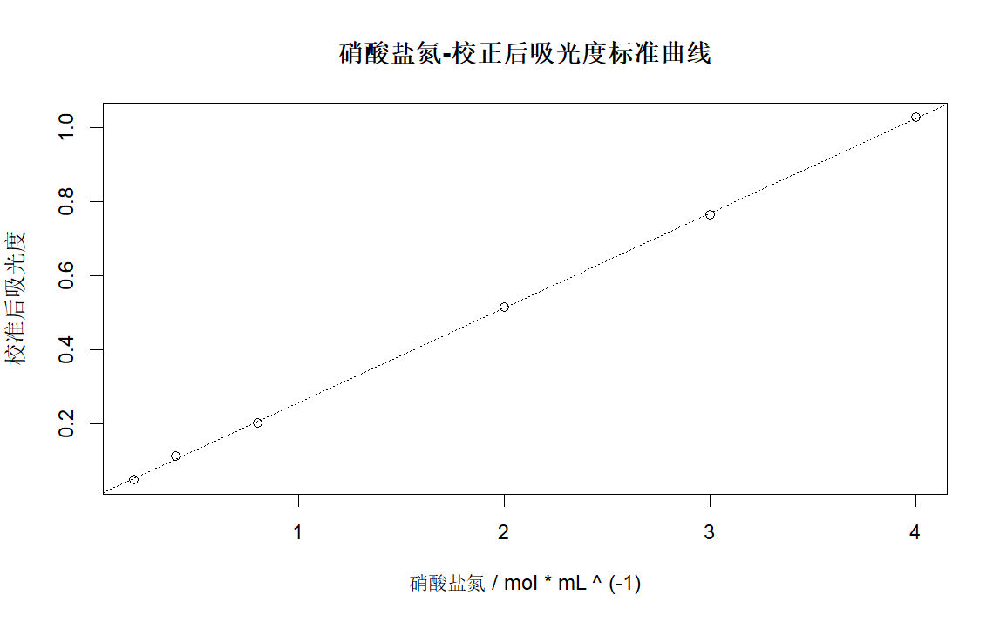
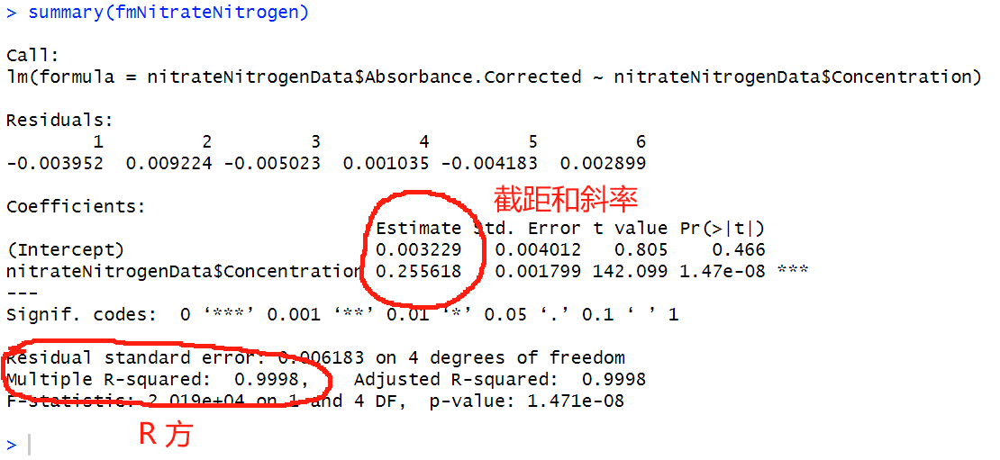

:::tip
在本节中，你可以学会
- R 语言中使用最小二乘法拟合线性模型
- R 语言中查看 lm() 函数结果的 R square 和 截距、斜率
:::

## 0. 前言

本次拟合标准曲线，以**水中氨氮、硝酸盐氮含量测定实验**为例。

[氨氮的标准曲线实验数据（csv格式）](./assets/dataset-ammonia-nitrogen.csv)

[硝酸盐氮的标准曲线实验数据（csv格式）](./assets/dataset-nitrate-nitrogen.csv)

## 1 准备绘制标准曲线的数据

### 1.0 水样体积

50 mL。

```r
sampleVoloume <- 50
```

### 1.1 氨氮

创建名为 `dataset-ammonia-nitrogen-dataset.csv` 的文件准备氨氮标准曲线的数据。

解释：
- StandardSolution：浓度 10mg/mL 氨氮标准溶液（单位：mL）。
- Absorbance@425nm：溶液在 425nm波长的吸光度。

| StandardSolution | Absorbance@425nm |
|------------------|------------------|
| 0.0              | 0.052            |
| 0.5              | 0.072            |
| 1.0              | 0.089            |
| 2.0              | 0.123            |
| 3.0              | 0.153            |
| 5.0              | 0.215            |

```csv
StandardSolution,Absorbance@425nm
0,0.052
0.5,0.072
1,0.089
2,0.123
3,0.153
5,0.215
```

### 1.2 硝酸盐氮

创建名为 `dataset-nitrate-nitrogen.csv` 的文件准备硝酸盐氮标准曲线的数据。

解释：
- StandardSolution：稀释十倍后的浓度 100mg/mL 硝酸钾标准溶液（单位：mL）。
- Absorbance@220nm：溶液在 220nm波长的吸光度。
- Absorbance@275nm：溶液在 275nm波长的吸光度。

| StandardSolution | Absorbance@220nm | Absorbance@275nm |
|------------------|------------------|------------------|
| 1                | 0.0408           | -0.0048          |
| 2                | 0.1099           | -0.0024          |
| 4                | 0.1811           | -0.0108          |
| 10               | 0.5031           | -0.0062          |
| 15               | 0.7657           | -0.0001          |
| 20               | 1.0444           | 0.0079           |

```csv
StandardSolution,Absorbance@220nm,Absorbance@275nm
1,0.0408,-0.0048
2,0.1099,-0.0024
4,0.1811,-0.0108
10,0.5031,-0.0062
15,0.7657,-0.0001
20,1.0444,0.0079
```

## 2. 绘制标准曲线

```r
# 导入标准曲线数据

## 氨氮
ammoniaNitrogenData <- read.csv("dataset-ammonia-nitrogen.csv")
## 硝酸盐氮
nitrateNitrogenData <- read.csv("dataset-nitrate-nitrogen.csv")
```

#### 2.1 氨氮

```r
# 计算每支比色皿中氨氮浓度
ammoniaNitrogenData$Concentration <- 
  ammoniaNitrogenData$StandardSolution * 10 / sampleVolume
  
# 拟合线性模型
fmAmmoniaNitrogen <- lm(
  ammoniaNitrogenData$Absorbance.425nm ~ ammoniaNitrogenData$Concentration,
  )
  
# 作图
plot(
  ammoniaNitrogenData$Concentration, ammoniaNitrogenData$Absorbance.425nm,
  main = "氨氮-425nm处吸光度标准曲线",
  xlab = "氨氮浓度 / mol * mL ^ (-1)",
  ylab = "425nm 处吸光度"
  )
abline(coef(fmAmmoniaNitrogen), lty = 3)

# 得到模型数据
summary(fmAmmoniaNitrogen)
```

氨氮浓度-425nm吸光度图像（plot）



拟合总结（summary）



#### 2.2 硝酸盐氮

```r
# 计算每支比色皿中硝酸盐氮浓度
nitrateNitrogenData$Concentration <- 
  nitrateNitrogenData$StandardSolution * (100 / 10) / sampleVolume

# 校正吸光度
nitrateNitrogenData$Absorbance.Corrected <- 
  nitrateNitrogenData$Absorbance.220nm - 
  2 * nitrateNitrogenData$Absorbance.275nm

# 作图
fmNitrateNitrogen <- lm(
  nitrateNitrogenData$Absorbance.Corrected ~ nitrateNitrogenData$Concentration,
)
plot(
  nitrateNitrogenData$Concentration, nitrateNitrogenData$Absorbance.Corrected,
  main = "硝酸盐氮-校正后吸光度标准曲线",
  xlab = "硝酸盐氮 / mol * mL ^ (-1)",
  ylab = "校准后吸光度"
)
abline(coef(fmNitrateNitrogen), lty = 3)
summary(fmNitrateNitrogen)
```

硝酸盐氮-校正后吸光度图像（plot）



拟合总结（summary）



## 3. 全部代码（含注释）

```r
# 导入标准曲线数据
ammoniaNitrogenData <- read.csv("dataset-ammonia-nitrogen.csv")
nitrateNitrogenData <- read.csv("dataset-nitrate-nitrogen.csv")

# 准备样品数据
sampleVolume <- 50
sampleAmmoniaNitrogenAborbance.425nm <- 0.223
sampleNitrateNitrogenAborbance.220nm <- 0.3065
sampleNitrateNitrogenAborbance.275nm <- 0.0175

# 计算标准曲线中水样浓度
ammoniaNitrogenData$Concentration <- 
  ammoniaNitrogenData$StandardSolution * 10 / sampleVolume
nitrateNitrogenData$Concentration <- 
  nitrateNitrogenData$StandardSolution * (100 / 10) / sampleVolume

# 绘制标准曲线

## 氨氮
fmAmmoniaNitrogen <- lm(
  ammoniaNitrogenData$Absorbance.425nm ~ ammoniaNitrogenData$Concentration,
  )
plot(
  ammoniaNitrogenData$Concentration, ammoniaNitrogenData$Absorbance.425nm,
  main = "氨氮-425nm处吸光度标准曲线",
  xlab = "氨氮浓度 / mol * mL ^ (-1)",
  ylab = "425nm 处吸光度"
  )
abline(coef(fmAmmoniaNitrogen), lty = 3)
summary(fmAmmoniaNitrogen)

## 硝酸盐氮
### 校正吸光度
nitrateNitrogenData$Absorbance.Corrected <- 
  nitrateNitrogenData$Absorbance.220nm - 
  2 * nitrateNitrogenData$Absorbance.275nm
### 作图
fmNitrateNitrogen <- lm(
  nitrateNitrogenData$Absorbance.Corrected ~ nitrateNitrogenData$Concentration,
)
plot(
  nitrateNitrogenData$Concentration, nitrateNitrogenData$Absorbance.Corrected,
  main = "硝酸盐氮-校正后吸光度标准曲线",
  xlab = "硝酸盐氮 / mol * mL ^ (-1)",
  ylab = "校准后吸光度"
)
abline(coef(fmNitrateNitrogen), lty = 3)
summary(fmNitrateNitrogen)
```
